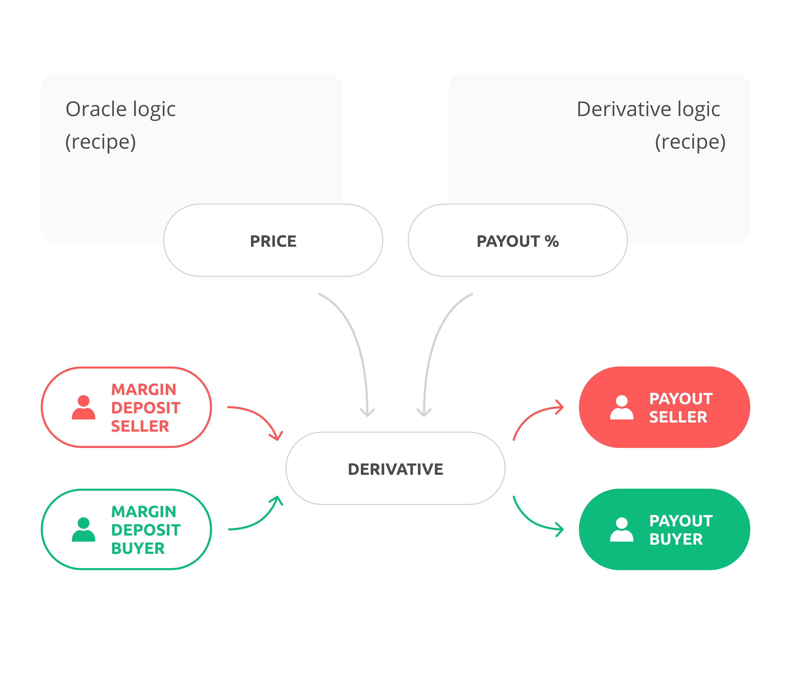

# Opium derivatives

Opium derivatives are a special animal that can handle the logic of most financial deals between traders. 

What is **common** between all financial derivatives? 

1. They all are agreements between future buyer\(s\) and seller\(s\) also known as _counterparties._
2. All derivatives have an underlying product and price source \(important for blockchain\)
3. Every derivative specifies the maturity date, margin requirements and other specifics such as strike price, leverage or pay-out clauses.

What are the **differences** among derivatives?

1. Mechanism of P&L among counterparties. 
2. Other technical details such as settlement-price calculation, way of delivery after execution and law and regulation.

The motivation to built Opium was to create an innovative protocol that can handle various derivatives in the same way and provide settlement and trading based on blockchain guaranteeing trustless and virtually free of charge administration. 

Opium defines derivatives as follows:


_**Opium derivative:**_ Two counterparties enter into a deal and deposit margins m1 and m2. The derivative is created and the counterparties' Long or Short position is ''stored'' in an Opium derivative token. After the maturity of the contract, the total margin M=m1+m2 is redistributed according to the derivative recipe formula_**,**_ based on the price that is fed by the oracle recipe at maturity. The first party receives x% of the total margin and the second party receives \(1-x%\) of the total margin deposit M correspondingly.


By changing the derivative logic component and using it in combination with an oracle logic component, we virtually can create any financial instrument on any asset. 

Think about derivatives on cryptocurrencies, hash-rates of a blockchain and just simply stocks, bonds, swaps, and commodities. All is possible with the right derivative and oracle recipe. When markets are established, users can build their own products on products \(options on futures for example\), but also insurance products to cover tail risks of other products and ensure tranches of a certain index of products.

