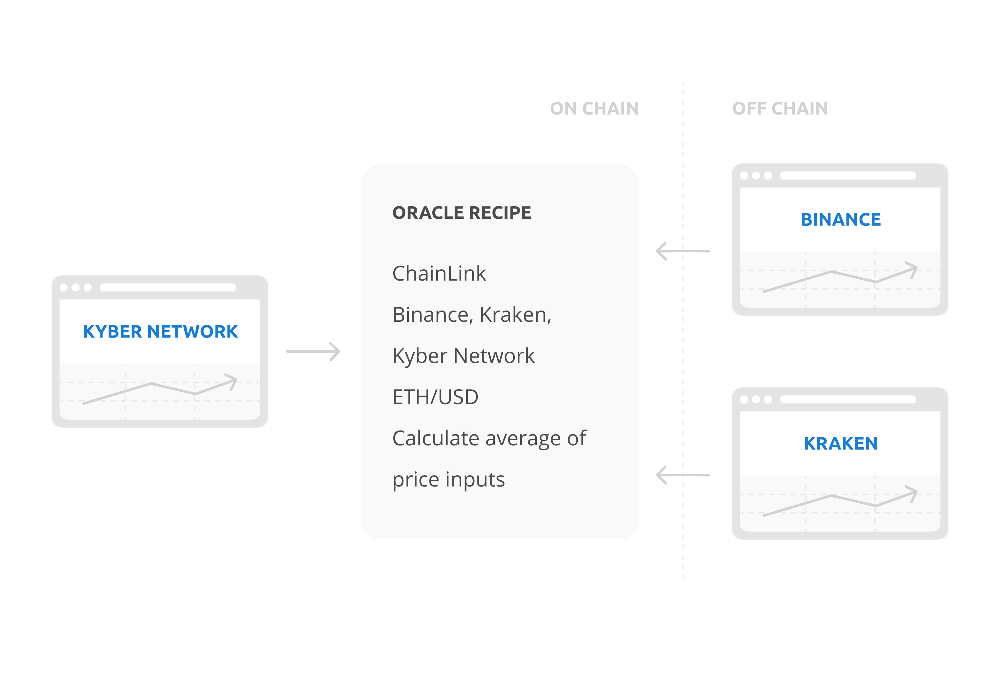

# Oracle and derivative recipes

Oracle and derivative recipes are special contracts in which anyone can describe the logic of a derivative or oracle. This logic is stored in the recipe, and the Opium core has access to it when it wants to run the logic when needed, for example at the execution of positions. The Opium core checks the formulas in derivative or oracle recipes and uses the result for getting the price from the real world and redistribution of the margin.  
  
Derivative recipes can be constructed for any derivative as the high-level logic is the same: payouts of margin inputs are calculated in some way \(derivative recipe\) according to certain price or event data \(oracle recipe\). Derivatives in the Opium Network can be cash-settled or physically delivered \(in case of cryptocurrency or tokenized asset\). Derivative recipes describe how margin inputs are paid out at execution, and oracle recipes describe the way of data fetching, which exact data is fetched and how this data is processed.

As an example, a contract can be based on the US Dollar price of Ethereum that uses an oracle recipe that simply fetches the data from Binance by using Oraclize and directly feeds it to the contract.

A more complex variant can be where the price is fetched from Binance, Kraken and the KyberNetwork, where the price from Binance and Kraken is fetched through ChainLink and the price from KyberNetwork with a read function on the Ethereum network. After fetching the 3 prices, an average is calculated and fed into the registry contract to calculate the payout. 

Many variants to feed data can be thought of and the Opium Network does not limit anyone to use a specific solution for their contracts:

* Oraclize
* ChainLink
* Tellor
* Running an auction
* Voting
* Manually
* Others...

The beautiful thing about Opium recipes is that they are Turing complete, and thus can comprise any logic. For example, if a data source does not respond, certain dispute resolutions as a second data source or voting can be implemented. 

  
  

