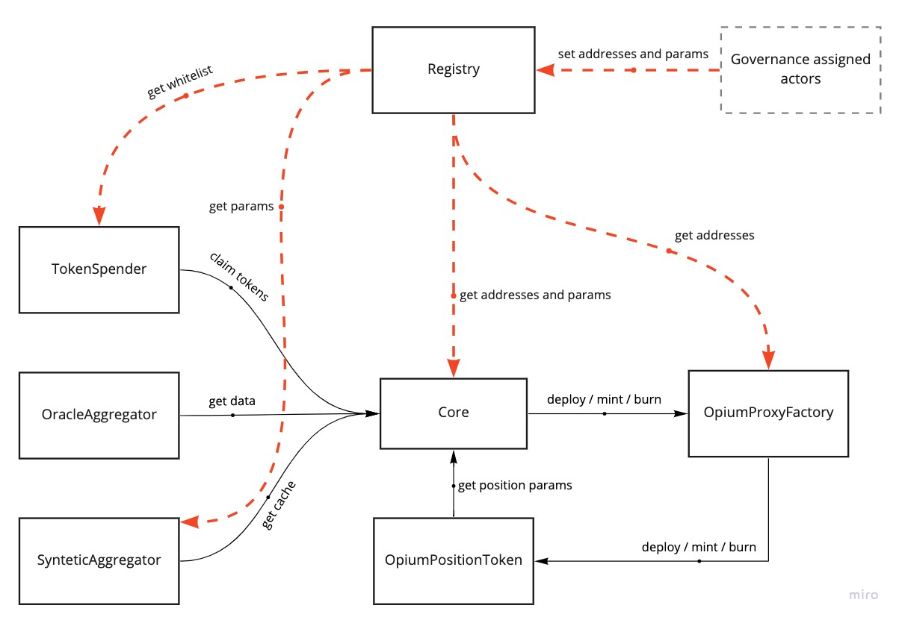

# Opium Protocol V2

## Introduction

Opium v2 is a permissionless smart financial escrow protocol that allows its users to create fully customizable financial products. Its primary use-case is the management of derivatives, which are represented as a pair of LONG and SHORT ERC20 Opium position tokens. As a financial engineer, you can easily create a derivative contract with Opium v2 and be rewarded a portion of the reserves accrued by the protocol for each successful settlement of your own financial products. As a seller and buyer, you can partake in (for example) PUT or CALL options on an underlying by holding a specific Opium position token, you can exchange them on an AMM, exercise them at expiry or redeem them for initial margin if you hold an equal amount of LONG and SHORT positions. The focus of the design is to be as lean as possible as to enable the greatest flexibility and interoperability with other financial primitives.

## **Changelog from Opium Protocol v1**

1. Completely removed `pooled derivative` logic
2. Changed `ERC721o` to `ERC20`: `LONG` and `SHORT` position tokens and removed `TokenMinter` contract
3. Removed all Matching contracts, as ERC20 positions are compatible with protocols like `1inch Limit Order Protocol` and `0x`
4. Changed Solidity version to latest with best practices refactoring
5. Changed `create` to support `amounts` instead of `quantities` (fractional derivatives)
6. Separated `create` process into `create` and `mint` to reduce gas costs
7. Changed `execute` to support `amounts` instead of `quantities` (fractional derivatives)
8. Added `redeem` derivatives function to burn `LONG` + `SHORT` in return of `initial margin`
9. Added upgradability
10. Added emergency mechanisms
11. Added governance and roles
12. Performed additional refactoring and optimizations

## Core protocol modules

