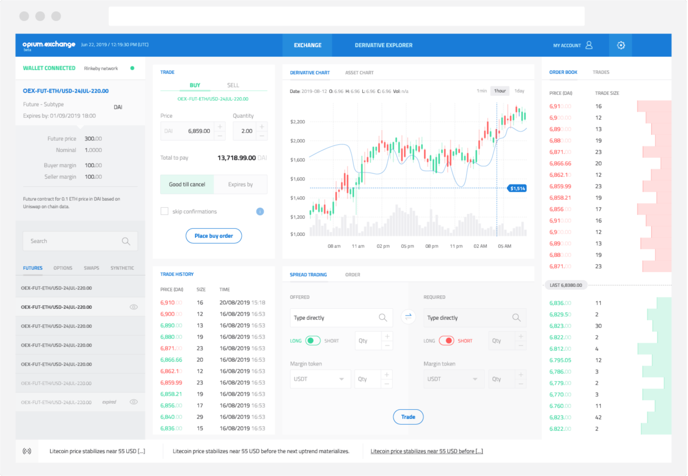

# opium.exchange

* Opium Exchange is a non-custodial platform for decentralized derivatives
* Trade, hedge, or invest without intermediaries
* Audited by SmartDec
* High-speed orders on meta-transactions are combined with on-chain settlement
* Marginal trades: from regular margin to turbo trades

You can check it out on [**opium.exchange**](https://opium.exchange)** **

_Opium.Exchange is not available in the United States or other prohibited jurisdictions._
