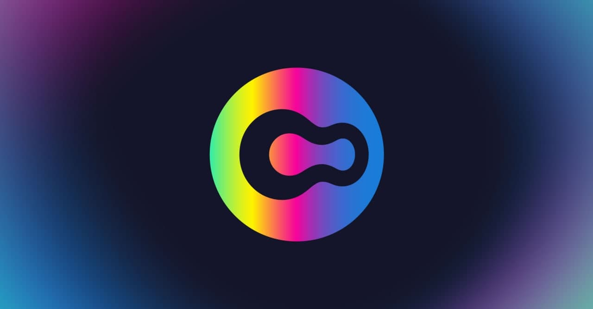

# Governance

The goal of Opium is to create a synthetic derivatives protocol that everybody can use. Priority number one was full decentralization.

Today, we’re proud to introduce the Opium governance system in charge of all governance of the protocol’s parameters and code. Governance participants will have **rights and responsibilities** to suggest, debate, and implement decentralised protocol changes.

#### $Opium — a governance token

$OPIUM token is created for governance purposes to transfer the ownership over Opium protocol to the community. Since the token is live, the governance process will be controlled by OPIUM DAO, which managed by $OPIUM holders active participants of Opium Protocol.

The Opium Protocol requires active and decentralized governance of specific parameters to evolve the protocol for the community’s benefit. This, in turn, will result in the creation of relevant decentralized financial instruments with sufficient liquidity — which will ultimately attract more users to the Opium ecosystem.

_$OPIUM is designed for community governance — it is in no way an investment opportunity or fundraising device. By owning the token, you also have responsibilities towards the decentralized community._

#### Decentralised governance

The governance model is based on a decentralised autonomous organisation \(Aragon DAO\). $OPIUM token holders will interact with the DAO by proposing and casting votes on governance proposals, which will change the codebase and parameters of the Protocol and its stakeholders’ behaviour.

One of the critical parameters that $OPIUM token holders will control is allocating $OPIUM governance tokens from the Active-User Ecosystem Fund. An amount of $OPIUM tokens will be unlocked every month to be distributed among active protocol users and benefit the Opium ecosystem over a maximum of 5 years.

Anybody who has $OPIUM tokens can propose a governance action. Proposals can be executable transactions, acts or even a new code base of the Protocol. All proposals will hold two days of voting time during which any address that had a voting power on the proposal’s moment can vote _for_ or _against_ the proposal. The action will be implemented if more than 50% voted in favour and at least 8 million tokens voted.

This governance model itself also can be changed to a new one or even upgraded to the more sophisticated DAOs in the future, when scalability and other challenges are solved. That’s why $OPIUM token designed to be a light ERC20 token representing the right to vote and can be wrapped into the any future DAO connected to the Protocol. Keep in mind that voters have the rights and responsibilities to vote and participate in the community.

