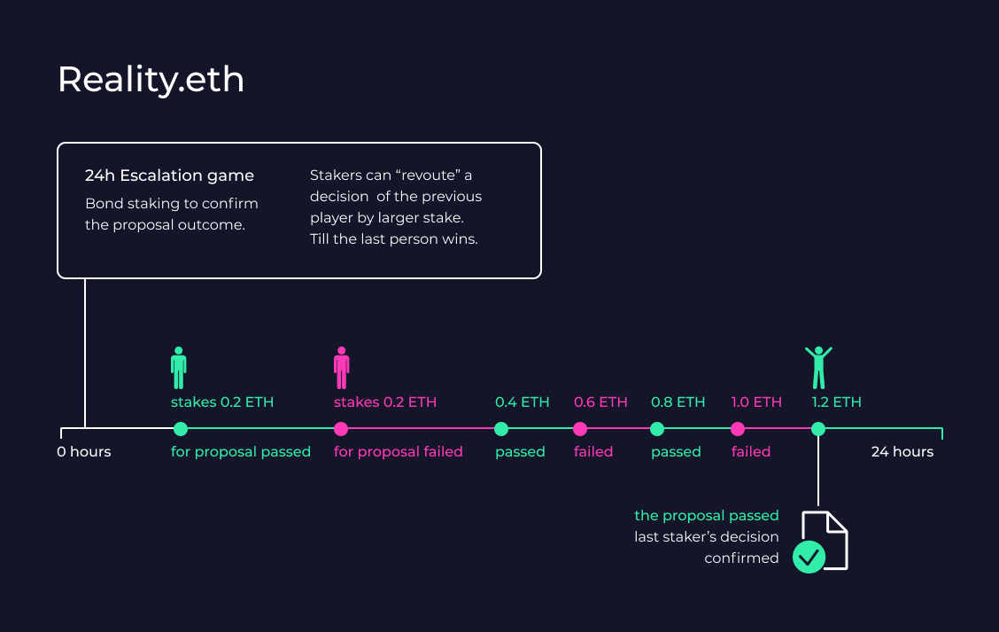

# Process of voting – technical description

As the voting on the proposals is happening off-chain, and to be able to verify the results on-chain, an oracle is needed. Reality.eth, an optimistic Layer 2 solution for voting, plays this role. The system verifies whether off-chain proposals and votes were made according to the DAO requirements by the Proof-of-Stake mechanism.

### Reality.eth

The proposal is sent to Reality.eth for 24 hours\* (\*the time frame can be changed by governance) for the bond staking. Bond is the minimum amount of ETH to be staked in Reality.eth to successfully validate the off-chain proposal and proceed with its on-chain execution.

For example, a person staked 0.2 ETH and confirmed that the proposal “passed”, then another  person staked 0.4 ETH and confirmed that the proposal “failed” and so on until the person who staked the biggest amount “wins'.' The last and their answer is sent as a try outcome.&#x20;

If there are suspicions of  foul play, anyone can stop the bond staking and ask the Arbitrator –(Opium Aragon DAO ) to have an on-chain voting about the proposal validation.

### Gnosis Safe

If the proposal passes the outcome is sent to the DAO Module of Gnosis Safe to execute the transactions outlined within the proposal. If the proposal fails, it is marked as an invalid transaction.

There is a standard additional security measure called Arbitrator, which allows anyone to put potentially malicious proposals on hold and to pass the right to provide the final decision to a particular 3rd party in case of disputes between stakers.

### Arbitrator

If there is a suspicious attempt  to overrule the actual results or send an invalid transaction and execute the malicious action. Opium Aragon DAO acts as Arbitrator and initiates an on-chain voting for Opium holders to decide whether the outcomes of the proposal are valid or not.&#x20;

### Guardians

There is an additional feature called Guardians that can be added if the community votes in favor of it.&#x20;

It is a “switch to on-chain voting” for every proposal that is being brought from optimistic on-chain layer to implementation. It can perform just one action, to request arbitration (freeze proposals) without the need to pay any arbitration fees. The Guardians are assignable by the owner of the Arbitration contract (Opium Aragon DAO). The rationale of Guardian is to allow a trusted entity (multisig of appointed guardians) to quickly react to the malicious or spam proposals without the need to waste money on arbitration fees. Since the Guardian’s actions are restricted and the Guardian could be easily changed by the Opium Aragon DAO, it does not introduce any single point of failure and serves solely for DAO security purposes.
