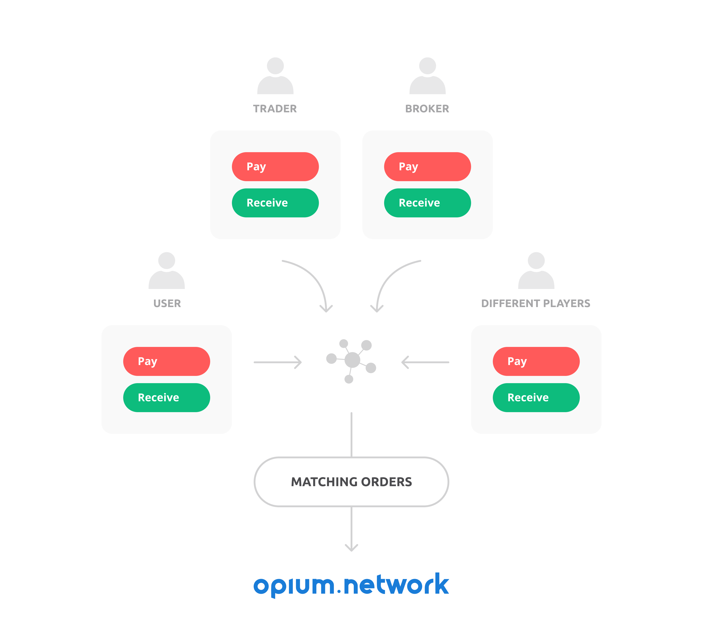
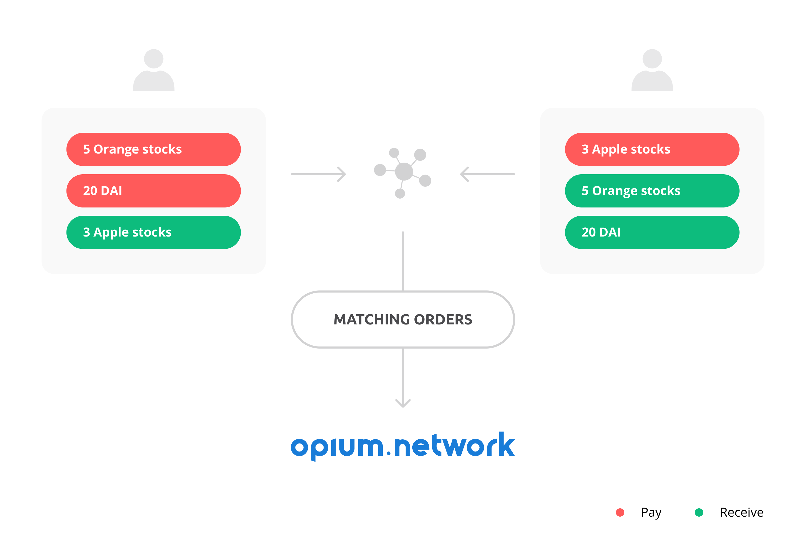
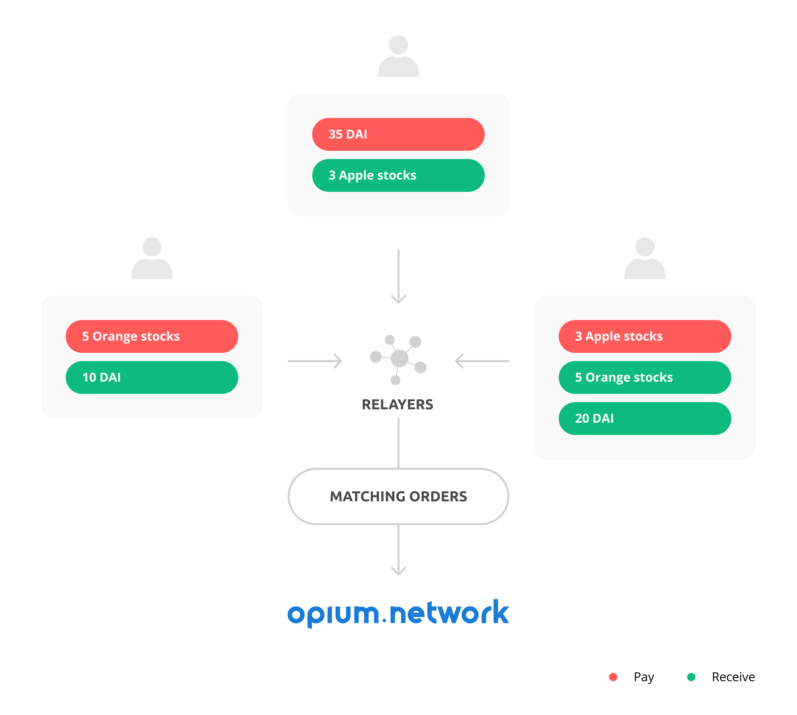

# Core explanation

The Opium network is an ecosystem that allows anyone to create, settle and trade virtually all derivatives and financial instruments in a professional and trustless way. 

> Various actors are incentivized to carry out operations such as matching orders, executing contracts, designing products and making the market efficient. Trading of products can be done against extremely low costs and contracts can be created exactly according to the wishes of buyers and sellers.

A financial product is made up of two components: **the derivative recipe** and **the oracle recipe**. The derivative recipe is a set of logic that defines how certain margin input is recalculated into a payout at the end of a contract. An oracle recipe describes how data will be fetched from an off-chain or on-chain source, which data exactly will be fetched, and how this data will be processed. Derivative and oracle recipes are registered at their respective **derivative or oracle register**. Data about margin inputs for positions is stored in the derivative register and fetched data from oracle recipes is stored in the oracle register. **The Opium Core** fetches data input from an oracle recipe at the oracle register to run calculations in the derivative recipe. As derivative and oracle recipes are Turing complete, they can comprise any possible logic. Products can, for example, be created on price movement, bankruptcy and political or sports events. Users can create many combinations of derivative recipes with oracle recipes and create a contract. **The Opium Core**, which is on-chain, checks if the input parameters, such as maturity, margin and, for example, strike price, fit the derivative and oracle recipe after which the token minter creates long or short tokens. 

**Long and short positions** are represented by **Opium derivative tokens** \(ERC-721o\) that give the user professional trading experience. Users can trade multiple of their positions at the same time and compose, decompose and recompose Opium portfolio tokens \(also ERC-721o\). This enables users, for example, to create and trade spreads, indexes, portfolios and other financial products without having the risk of one leg of the product not being executed, while saving gas costs. As Opium tokens are ERC-721 backward compatible, they can easily be traded in other places, for example, at relayers that use the 0x protocol.

Order in the Opium Network works according to the **TMtm** model. In order, a user signs how much of what \(derivatives + tokens\) he wants to receive, and how much of what \(derivatives + tokens\) he is willing to give in return. After sending the signed order to the relayer, the relayer matches it either directly with a counterparty or waits until a counterparty matches the order. After matching, the relayer broadcasts the orders to the Opium Network, where it is checked that both inputs match each other, but also the derivative and oracle recipe. After creation, both parties receive a long or short token.  
  
Note: the relayer will most likely demand a relay-fee for his services. 

It is a very common situation for professional traders to execute multiple trades simultaneously. For example, to create a certain exposure in two different assets or to lock in multiple prices at the same time. **The Opium TMtm swap** is a universal protocol request to swap multiple assets at the same time. 

A user states the amount of an Opium token and amount of an ERC-20 token he is willing to provide, and which amount of which Opium token and which amount of which ERC-20 token he wants to receive in return.

This request can be used in many ways, some examples are:

* Exchange any amount of an ERC-20 token for any amount of an ERC-20 token.
* Exchange any amount of an ERC-20 token for any amount of an Opium token.
* Exchange any amount of an Opium token for any amount of an Opium token. 
* Exchange any amount of an ERC-20 token for any amount of an Opium token + any amount of an ERC-20 token. Exchange any amount of an Opium token + any amount of an ERC-20 token for any amount of an Opium token.
* Exchange any amount of an Opium token + any amount of an ERC-20 token for any amount of an Opium token + any amount of an ERC-20 token. 

Opium contracts can understand TMtm logic of combined orders and even match them in the best execution policy\*.

An example of TMtm execution is as follows:

It may happen that arbitrage opportunities arise when orders can not be filled directly by one person. An arbitrageur can step in to fill multiple separate orders and make a profit.

