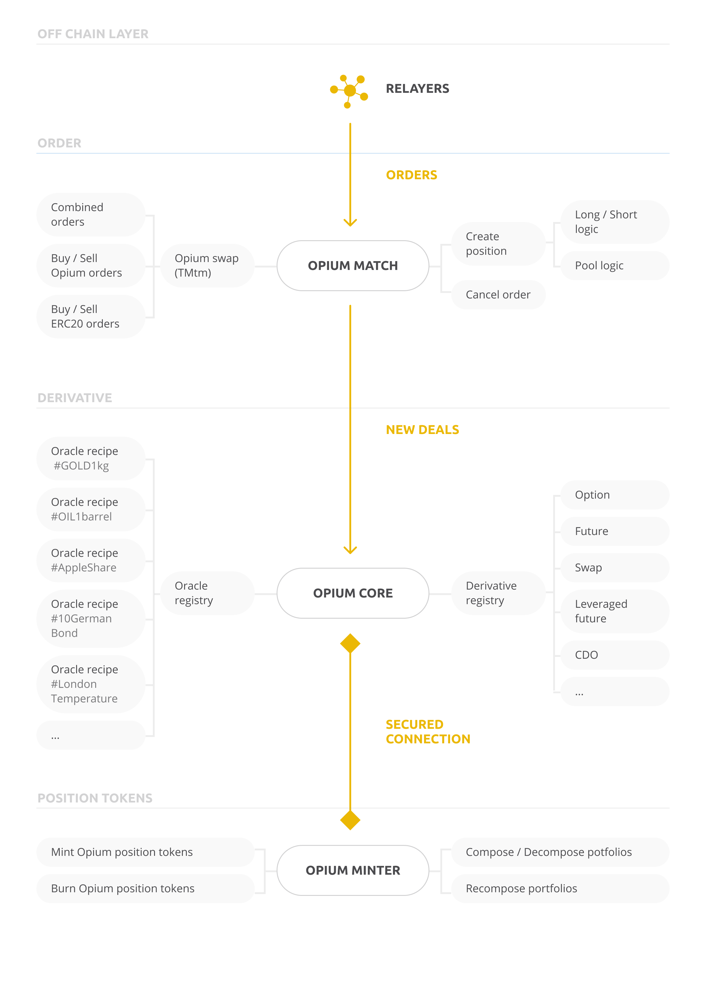

# Opium layers

The Opium network consists of several layers: it starts with the off-chain matching of orders and ends with the minting of Opium Tokens on the Ethereum blockchain. In our examples, we omit the possibility of on-chain order books. As they are computationally heavy and impractical because of block producing times we expect that off-chain order matching will be the standard for relayers in the Opium Network.

After users sent their orders to the relayer, orders are matched and broadcasted to the blockchain layer, to the Opium gateway contract: Opium Match. This contract creates new positions out of the stable coins or other margin tokens \(see Opium Margin\) and it also executes swaps of positions \(see Opium Swaps\) and ERC20 tokens. Users give allowance to this matching contract to move their tokens according to the matched order.

The Opium Core contract is securely connected to the oracle and derivative registries and minter. The main function of Core is to execute the logic of receiving and paying off the margins from and to users.

The Oracle register stores all the data, supplied by oracle recipes, that was ever requested by the system. If 10000 options are outstanding with the same oracle recipe, this means that the data will be transferred once to the blockchain and every option will fetch the data from the registry. The Derivative Registry keeps track of all the underlying margins behind each ticker and oracle ID to make sure we never run out of margin even if a third party derivative recipe is corrupted.

Finally, the Opium Minter is responsible for minting Opium derivative tokens and Opium portfolio tokens. When two matched orders are processed by the Opium match and Opium core contracts, the Opium minter contract mints new Opium derivative tokens \(on behalf of the Core contract\) and burns them once the contract is executed. The Minter also takes care of composing, recomposing and decomposing Opium derivative tokens into Opium portfolio tokens.  

