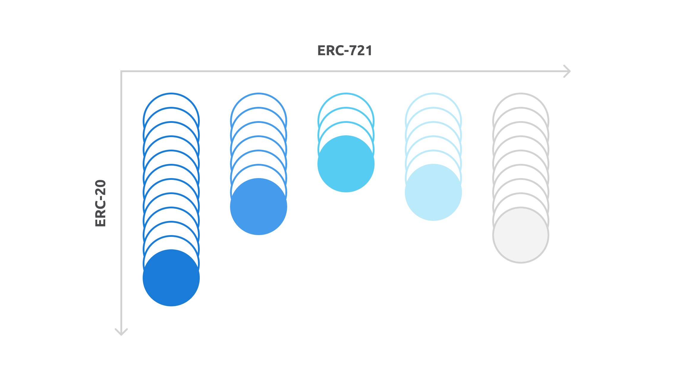
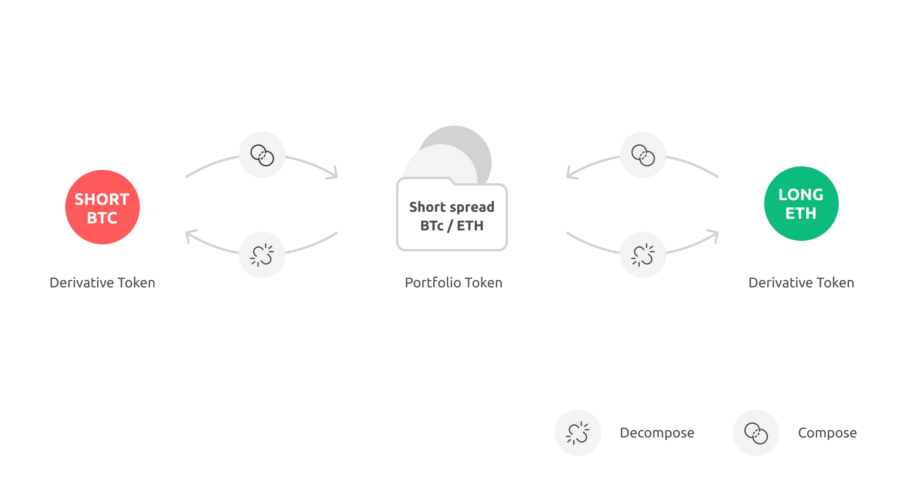
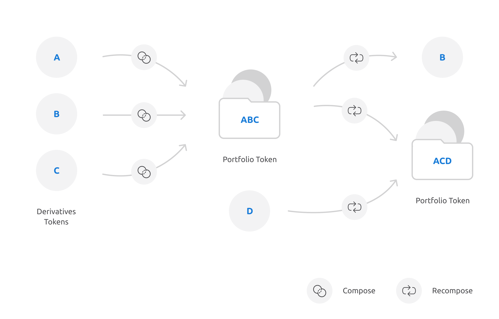

# Opium token standard

The Opium team was motivated by the real financial markets to create a token standard that can represent financial instruments that are traded on exchanges. An _exchange-traded product_ is a standardized financial instrument that is traded on an organized exchange. Therefore, such products are interchangeable with the same standardized products. Standardization of products means setting parameters such as price source, maturity, quantity, documentation, and regulation. For example, two future contracts on gold with the same standardized parameters are absolutely the same, but they are different from similar futures for oil. They are also different from futures contracts on gold that have a different maturity.

We have created the standard that allows having all kinds of different non-interchangeable tokens like ERC-721, but each can be minted in any quantity, is interchangeable with its "twins".

#### ERC-721o standard

The ERC-721o token standard is a combination of the ERC-20 and ERC-721 token standards with extra functionalities. It allows for batch transfer \(and thus optimizing gas usage\) and natively creating portfolios. In financial markets, instruments can be the same and interchangeable with each other, but there are many types of different instruments. Different by maturity, underlying or standard conventions. Our inspiration to develop this token standard comes from the real financial markets, where often positions are traded in large sizes and portfolios are used to take multiple positions at once, without having the risk of 1 leg of the portfolio not being executed \(see examples below\). At the same time, ERC-721o tokens are backward compatible with the ERC-721 token standard and thus can be traded in existing ecosystems where, for example, relayers use the 0x protocol.

Financial instruments most of the time are combined and managed as portfolios. This motivates us to create a possibility to wrap several tokens into a portfolio that is represented by one token. Once a portfolio is created, it is stored on the owner's balance and corresponding tokens are deleted from the blockchain.

We introduce three portfolio functions:


1. Compose: creates a portfolio out of tokens 
2. Decompose: recreates tokens out of a portfolio 
3. Recompose: adds/takes several tokens to/from an existing portfolio in a gas efficient way


Once composed, the whole portfolio can be managed or traded as one token, saving gas and implementing convenient financial logic. 

When the portfolio decompose function is used, the tokens that were used to compose the portfolio are minted again and stored on the owners' balance.

We can get the ID of a portfolio token through a simple cryptographic wrap hash function: 

$$
TokenID = hash (DerivativeID + "LONG/SHORT") \quad  (1) 
\\PortfolioTokenID=hash(tokenID_1+tokenID_2+...+tokenID_N)\quad (2)
$$

Another function of the ERC-721o standard is recomposing. New position tokens can be added to the existing portfolio token, but position tokens can also be taken out from the portfolio token. This function works in a gas efficient way and allows you to add/take tokens with one transaction.

Minting and burning of Opium derivative tokens are done **only** on order of the Opium core contract and therefore are always backed by the necessary margin in the network. 

Owners can interact with the Opium minting contract by managing their positions within sending, composing and recomposing requests, but can not directly request minting or burning of a token. To mint or burn a token, users should send enough margin to the corresponding derivative recipe or execute and withdraw an existing position after maturity. 

Besides the newly introduced portfolio functions, we inherited several functions from the ERC721x token standard:


1. transferFrom: sends a particular amount of a specific token ID from one address to another 
2. batchTransferFrom: allows you to send multiple non-identical tokens with different amounts in one transaction 
3. approve: grants someone else permission to spend any amount of a specific tokenID on the owner's behalf 
4. setApprovalForAll: grants someone else permission to spend any amount of any tokenID  on the owner's behalf


We refer you to read about the derivative token standard and its reference implementation on its official page. [https://erc721o.org/](https://erc721o.org/)

